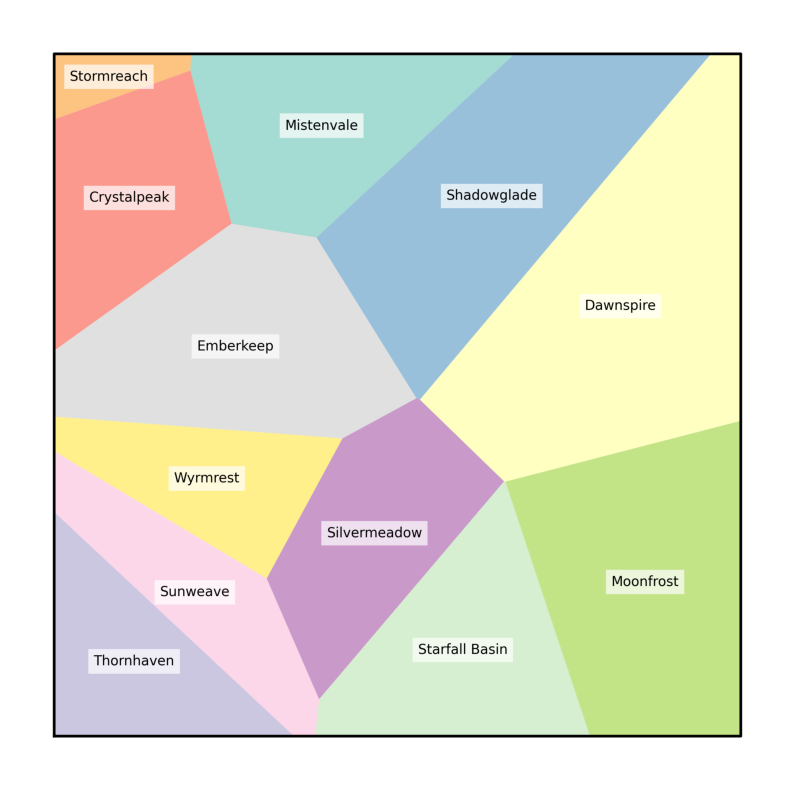
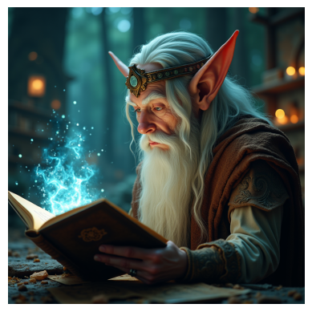
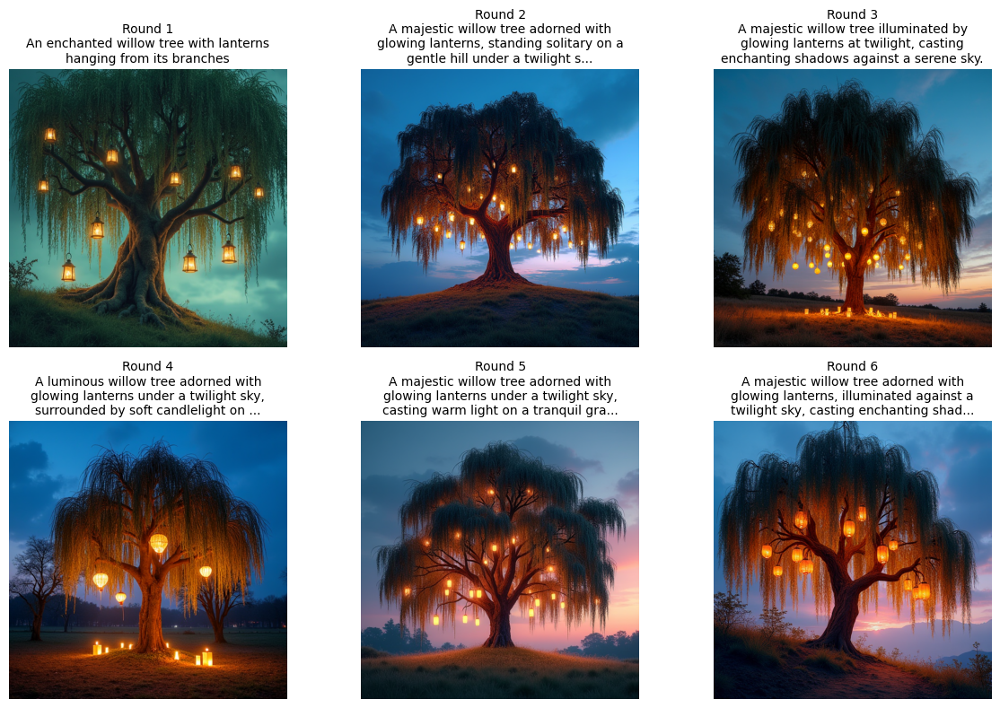

<a href="https://colab.research.google.com/github/Nebius-Academy/LLM-Engineering-Essentials/blob/main/topic1/1.1_intro_to_llm_apis.ipynb" target="_parent"></a>

# LLM Engineering Essentials by Nebius Academy

Course github: [link](https://github.com/Nebius-Academy/LLM-Engineering-Essentials/tree/main)

The course is in development now, with more materials coming soon. [Subscribe to stay updated](https://academy.nebius.com/llm-engineering-essentials/update/)

# 1.1. Intro to LLM APIs

In this notebook, we'll start exploring LLMs and LLM APIs, their capabilities and their failures. After working with it, you'll be able to call APIs of LLMs and Multimodal LLMs such as GPT-4o, Llama-3.1-8B, Qwen2-VL-72B, and many more.

# The first step: getting API keys

Mostly we'll use the API of [**Nebius AI Studio**](https://qrco.de/naaistudio): This platform offers open-source LLMs from families such as Llama, Mistral, Qwen, and Gemma. Generate your API key here: [Nebius API Keys](https://studio.nebius.ai/settings/api-keys) (this page will only be available after you register).

However, in some examples we'll also check **OpenAI** API (https://platform.openai.com/), which provides access to GPT models like GPT-4. You can generate an API key here: [OpenAI API Keys](https://platform.openai.com/settings/organization/api-keys) (this page will only be available after you register).

An API key is just a string (usually, a long one). Each platform will only show you your API key once when it’s generated, so be sure to copy it and save it securely. If you lose your API key, you'll be able to generate a new one (but in this case, don't forget to invalidate the old one on a platform).
To set up for the class, please

* Save the Nebius API key in a file named `nebius_api_key` (also no file extension).
* Save the OpenAI API key in a file named `openai_api_key` (no file extension).
* Then load them both to colab.

We aim to explore close-to-production use of LLMs, so we start with APIs, but of course every LLM has its own playground:

- Nebius AI Studio's playground is here: https://studio.nebius.ai/playground.
- Feel free to play with OpenAI models here: https://chatgpt.com/.

# **Setting up the environment**

Let's install the `openai` library (the `-q` flag saves us from reading the outputs) and get the API keys.


```python
!pip install -q openai
```

You'll need to upload the API keys to your current Jupyter directory. If you're running Jupyter on your own Linux machine, you can check which directory it is by running `!pwd`


```python
import os
from dotenv import load_dotenv

# Load variables from .env file
load_dotenv(r"C:\Users\arkad\Projects\API keys\.env")

# Access the API key
nebius_api_key = os.getenv("NEBIUS_API_KEY")
openai_api_key = os.getenv("OPENAI_API_KEY")

os.environ["NEBIUS_API_KEY"] = nebius_api_key
os.environ["OPENAI_API_KEY"] = openai_api_key
```

# **Trying Nebius AI Studio and OpenAI**

## Nebius API

Nebius AI Studio serves several families of open source LLMs, including: Llama, Qwen, DeepSeek, Gemma, Mistral, Phi, and others.


### The client and the model

First of all, you need to define:

* **client**, which in case of Nebius AI Studio is

  ```
  client = OpenAI(
      base_url="https://api.studio.nebius.ai/v1/",
      api_key=os.environ.get("NEBIUS_API_KEY"),
  )
  ```

* **model**, that is the particular LLM we want to use. You can find more details about models, their pricing and other parameters [here](https://studio.nebius.ai/models).

  To get the right model name for the API call, press the small "copy" button at the top right corner of a model card:

  <center>
  
  </center>

  For example, **Llama-3.3-70B** should be called using `model = "meta-llama/Llama-3.3-70B-Instruct"`.

### Prompt and completion

The text passed to an LLM is usually called a **prompt** and the LLM's output is known as **completion** (or response).

Let's make a simple API call to illustrate this:


```python
from openai import OpenAI

client = OpenAI(
    base_url="https://api.studio.nebius.ai/v1/",
    api_key=os.environ.get("NEBIUS_API_KEY"),
)
model = "meta-llama/Llama-3.3-70B-Instruct"

completion = client.chat.completions.create(
    model=model,
    messages=[
        {
            "role": "user",
            # This is the prompt:
            "content": """The following Python implementation of the QuickSort algorithm contains a bug.
                          Find the bug and correct the code:
                          def quicksort(arr):
                              if len(arr) <= 1:
                                  return arr
                              pivot = arr[0]
                              left = [x for x in arr if x < pivot]
                              right = [x for x in arr if x >= pivot]
                              return quicksort(left) + [pivot] + quicksort(right)
                          """},
    ]
)
```

The `completion` variable contains much information; to extract only the completion. The answer itself is `completion.choices[0].message.content`:


```python
print(completion.choices[0].message.content)
```

    # Step-by-step analysis of the problem:
    1. The given implementation of the QuickSort algorithm seems mostly correct, as it properly partitions the array into a left and right sublist based on a pivot element.
    2. **The bug lies in the creation of the `right` sublist**. In the current implementation, `right` includes all elements greater than or equal to the pivot. However, this includes the pivot itself, which should not be part of the recursive call to `quicksort`.
    3. As a result, **the pivot element is duplicated in the sorted array**, because it is both included in the `right` sublist and explicitly appended to the result of the recursive calls.
    
    # Fixed solution:
    ```python
    def quicksort(arr):
        """
        Sorts an array using the QuickSort algorithm.
    
        Args:
            arr (list): The array to be sorted.
    
        Returns:
            list: The sorted array.
        """
        if len(arr) <= 1:
            # Base case: If the array has one or zero elements, it is already sorted.
            return arr
        pivot = arr[0]
        # Create the left sublist with elements less than the pivot.
        left = [x for x in arr[1:] if x < pivot]
        # Create the right sublist with elements greater than the pivot.
        right = [x for x in arr[1:] if x >= pivot]
        # Recursively sort the sublists and combine the results with the pivot.
        return quicksort(left) + [pivot] + quicksort(right)
    ```
    
    # Explanation of changes:
    *   **Modified the `left` and `right` list comprehensions** to iterate over `arr[1:]` instead of `arr`. This ensures that the pivot element itself is not included in either sublist.
    *   **Added comments to explain the purpose of each section** of the code, improving readability and maintainability.
    
    # Tests and example uses:
    ```python
    # Test the QuickSort function
    print(quicksort([3, 6, 8, 10, 1, 2, 1]))  # Output: [1, 1, 2, 3, 6, 8, 10]
    print(quicksort([5, 2, 9, 1, 7, 6, 8]))  # Output: [1, 2, 5, 6, 7, 8, 9]
    print(quicksort([1, 1, 1, 1]))  # Output: [1, 1, 1, 1]
    print(quicksort([]))  # Output: []
    print(quicksort([5]))  # Output: [5]
    ```
    

The `"usage"` dictionary stores token statistics that can be used to estimate the generation cost. You can check LLM pricing details in their model cards. As for February 18th, 2025, for the **Llama-3.1-8B** model you'd pay:

* \$0.13 / 1M (million) input (prompt) tokens,
* \$0.5 / 1M output (completion) tokens.

Let's calculate the price for our example:


```python
(completion.usage.prompt_tokens * 0.13 + completion.usage.completion_tokens * 0.5) / (10**6)
```


    0.00030088


Which is way less than 1 cent.

The prompt and completion length are indicated in **tokens**, which are usually word pieces. We'll discuss tokenization later this week.

### Dialog roles

The `messages` object you pass to the LLM API is a dictionary with fields `"content"` and `"role"`. Roles may be:

- `"user"`, that's you.
- `"assistant"`, a model's cue.
- `"system"` used to pass our wishes regarding the assistant's tone of voice, restrictions etc.

So, a dialog between a user and an LLM may look like:

```
messages=[
        {
            "role": "system",
            "content": <system prompt>
        },
        {
            "role": "user",
            "content": <user's first line>
        },
        {
            "role": "assistant"
            "content": <LLM's answer>
        },
        {
            "role": "user"
            "content": <user's second line>
        }
    ]
```

Let's look at an example:


```python
client = OpenAI(
    base_url="https://api.studio.nebius.ai/v1/",
    api_key=os.environ.get("NEBIUS_API_KEY"),
)
model = "meta-llama/Llama-3.3-70B-Instruct"

messages = [
        {
            "role": "system",
            "content": "You are a helpful assistant."
        },
        {
            "role": "user",
            "content": """Who's a cooler fantasy writer: J. R. R. Tolkien or George R. R. Martin.?"""
        },
]

completion = client.chat.completions.create(
    model=model,
    messages=messages
)
completion.choices[0].message.content
```


    'Both J.R.R. Tolkien and George R.R. Martin are incredibly talented and influential fantasy writers, but in different ways. It\'s subjective to determine who\'s "cooler," as it ultimately depends on personal taste and preferences. Here\'s a brief comparison:\n\n**Tolkien: The Master World-Builder**\nTolkien is often considered the father of modern fantasy. His Middle-earth legendarium, as seen in "The Hobbit" and "The Lord of the Rings," is a meticulously crafted world with a rich history, languages, and cultures. His writing style is often described as epic, descriptive, and nostalgic. Tolkien\'s work has had a profound impact on the fantasy genre, inspiring countless authors, artists, and filmmakers.\n\n**George R.R. Martin: The King of Complex Characters**\nGeorge R.R. Martin, on the other hand, is known for his A Song of Ice and Fire series, which has been adapted into the hit TV show Game of Thrones. Martin\'s writing style is often described as gritty, realistic, and character-driven. He\'s renowned for his complex, multi-dimensional characters, morally ambiguous themes, and unexpected plot twists. Martin\'s work has redefined the fantasy genre, pushing boundaries and exploring mature themes.\n\n**Coolness factor:**\nIf you\'re into epic, traditional fantasy with a focus on world-building and mythology, Tolkien might be the cooler choice. His work has a timeless, classic feel that has captivated readers for generations.\n\nIf you prefer more mature, complex, and morally ambiguous storytelling with a focus on character development and political intrigue, George R.R. Martin might be the cooler choice. His work has reinvigorated the fantasy genre and inspired a new wave of authors and creators.\n\nUltimately, both authors are cooler in their own ways, and it\'s not necessarily a question of who\'s better. You can appreciate and enjoy both Tolkien\'s and Martin\'s works, as they offer unique experiences and perspectives on the fantasy genre.\n\nSo, who\'s cooler? Well, that\'s up to you! Do you have a preference for traditional, epic fantasy or more modern, complex storytelling?'


We may continue dialog by appending the LLM's answer as an **assistant** message to the `messages` list and then adding the user's next question:


```python
# We add the assistant's message
messages.append(
    {
        "role": "assistant",
        "content": completion.choices[0].message.content
    }
)

# Now, let's continue the dialog
messages.append(
    {
        "role": "user",
        "content": "But which one do you prefer? Choose only one of them!"
    }
)

completion = client.chat.completions.create(
    model=model,
    messages=messages
)
completion.choices[0].message.content
```


    "As a neutral AI, I don't have personal preferences, but I can play along and make a choice for the sake of fun.\n\nIn that case, I'll choose... George R.R. Martin!\n\nI find his ability to craft intricate, complex characters and weave them into a rich, detailed world to be truly captivating. The way he explores mature themes, moral ambiguity, and the human condition makes his work feel more relatable and thought-provoking. Plus, his willingness to take risks and subvert traditional fantasy tropes has helped to evolve the genre and inspire new writers.\n\nOf course, this is just a hypothetical choice, and I think both authors are amazing in their own ways. But if I had to pick one, I'd go with Martin's brand of gritty, realistic fantasy.\n\nNow, don't tell Tolkien fans I said that!"


This way, you may keep quite long conversations in an LLM's "memory". But this memory isn't infinite; at some point you may hit the max context length.

**Note**. Structuring dialog as a list of messages is a good LLM engineering practice, but under the hood, all these messages are concatenated into something like this (the exact format depends on the LLM)

```
#SYSTEM
<system message>

#USER
<user's line 1>

#ASSISTANT
<assistant's line 1>

#USER
<user's line 2>
```

to be sent to the LLM as one structured prompt.

### Max context length

Each LLM has **max context length**, which is the maximal sum of lengths of all messages the LLM is going to process. For Llama-3.1 models it's 128k tokens. After you hit max context length, some of the starting messages will be ignored.

A short reference for you about the lengths of various data (with the tokenizer of Llama-3-8B; see details below; the numbers for other models' tokenizers would be close to that).

| Text  | n_tokens  |
|----------|----------|
| [Text2text\_generation.py from Transformers](https://github.com/huggingface/transformers/blob/main/src/transformers/pipelines/text2text_generation.py)   | 3.5k   |
| [xLSTM paper .tex file](https://arxiv.org/abs/2405.04517)    | 39k  |
| Harry Potter and the Philosopher's Stone | 109K |
| [UK Energy Act 2023](https://www.legislation.gov.uk/ukpga/2023/52/contents)   | 248k   |
| Lord of the Rings | 500K |
| Langchain github repo | 5.2M |
| Pytorch github repo | 28M |

And here are max context lengths of some of the popular LLMs:

| LLM  | max_tokens  |
|----------|----------|
| gpt-4o(-mini)   | 128k   |
| Claude 3.5 (Haiku & Sonnet)    | 200k  |
| Gemini 2.0 Flash | 1M |
| Llama 3.1   | 128k   |
| Qwen 2.5 | 128K |

These numbers are actually quite generous, and you'll be more than ok with them in most applications, but, as you see, some documents or document collections just can't be process by an LLM in one call.

## The max_tokens parameter

The API has many parameters which we'll be exploring in details in these notebooks. Let's start with `max_tokens`. It allows to control how many tokens will the **prompt + completion** have.

Let's look at an example:


```python
from openai import OpenAI

# Nebius uses the same OpenAI() class, but with additional details
client = OpenAI(
    base_url="https://api.studio.nebius.ai/v1/",
    api_key=os.environ.get("NEBIUS_API_KEY"),
)

# Which LLM to use
# For more models, see https://studio.nebius.ai/models
model = "meta-llama/Llama-3.3-70B-Instruct"
completion = client.chat.completions.create(
    model=model,
    messages=[
    {
        "role": "system",
        "content": """You're a helpful assistant."""
    },
    {
        "role": "user",
        "content": """Explain in details the plot of Silmarillion."""
    },
    ],
    max_tokens=52
)

print(completion.to_json())
```

    {
      "id": "chatcmpl-164d4ad29c554b26a85332f832b5ad1d",
      "choices": [
        {
          "finish_reason": "length",
          "index": 0,
          "logprobs": null,
          "message": {
            "content": "A monumental task! The Silmarillion is a rich and complex book written by J.R.R. Tolkien, a collection of stories and legends about the history of Middle-earth and the Elves. It's a challenging task to summarize the entire plot, but I'll",
            "refusal": null,
            "role": "assistant",
            "annotations": null,
            "audio": null,
            "function_call": null,
            "tool_calls": [],
            "reasoning_content": null
          },
          "stop_reason": null
        }
      ],
      "created": 1765043167,
      "model": "meta-llama/Llama-3.3-70B-Instruct",
      "object": "chat.completion",
      "service_tier": null,
      "system_fingerprint": null,
      "usage": {
        "completion_tokens": 52,
        "prompt_tokens": 52,
        "total_tokens": 104,
        "completion_tokens_details": null,
        "prompt_tokens_details": null
      },
      "prompt_logprobs": null
    }
    

Note that `"finishing_reason"` is now `"length"` (instead of `"stop"`, which would mean normal termination). This means that generation was stopped when it hit `max_tokens`.

Let's also extract the answer itself:


```python
print(completion.choices[0].message.content)
```

    A monumental task! The Silmarillion is a rich and complex book written by J.R.R. Tolkien, a collection of stories and legends about the history of Middle-earth and the Elves. It's a challenging task to summarize the entire plot, but I'll
    

As you see, it's far from being a detailed description of the plot.

## OpenAI API

In this notebook we'll also try OpenAI API.

Its **client** is just `OpenAI()`. You can check the OpenAI's [model reference page](https://platform.openai.com/docs/models) to see what choice of the **models** they have. At the moment, we'd suggest choosing between:

* **gpt-4o-mini**, which is cheap, fast, and overall quite powerful,
* **gpt-4o**, which is larger, more capable, and more expensive, but not terribly so.

Let's make a simple API call:


```python
from openai import OpenAI

client = OpenAI()
# Choosing which LLM to call
# More models here: https://platform.openai.com/docs/models
model = "gpt-4o-mini"

completion = client.chat.completions.create(
    model=model,
    messages=[
        {
            "role": "user",
            "content": """Who is the author of the Dune series?"""},
    ]
)
completion.choices[0].message.content
```


    'The original Dune series was written by Frank Herbert. He authored six novels in the series, starting with "Dune," which was published in 1965. After Frank Herbert\'s death, his son Brian Herbert, along with co-author Kevin J. Anderson, continued the series and expanded the Dune universe with additional novels and prequels.'


The API's interface is just the same.

# Multimodal input

Modern LLMs also increasingly incorporate other modalities, usually Images. LLMs that have such capabilities are called **VLM**s (Visual Language Models) or, more generally **MLLM**s (**Multimodal LLMs**).

Let's see how this works. For that, we'll load a synthetically generated map and ask **gpt-4o-mini** to find a route between two of its regions.


```python
!pip install -q gdown
!gdown 1OW4MjT6A-5gUpyAi0_NyH94tCoNKGu8p
```

    Downloading...
    From: https://drive.google.com/uc?id=1OW4MjT6A-5gUpyAi0_NyH94tCoNKGu8p
    To: c:\Users\arkad\Projects\LLM\LLM-Engineering-Essentials\topic1\map000.png
    
      0%|          | 0.00/190k [00:00<?, ?B/s]
    100%|██████████| 190k/190k [00:00<00:00, 1.09MB/s]
    100%|██████████| 190k/190k [00:00<00:00, 1.09MB/s]
    


```python
import matplotlib.pyplot as plt
import matplotlib.image as mpimg

img = mpimg.imread('map000.png')
plt.figure(figsize=(10, 10))
imgplot = plt.imshow(img)
plt.axis('off')
plt.show()
```


    

    


OpenAI API requires to encode an image with `base64` before sending it to an LLM:


```python
from openai import OpenAI
import base64

IMAGE_PATH = 'map000.png'
model = 'gpt-4o-mini'
client = OpenAI()

# Open the image file and encode it as a base64 string
def encode_image(image_path):
    with open(image_path, "rb") as image_file:
        return base64.b64encode(image_file.read()).decode("utf-8")

base64_image = encode_image(IMAGE_PATH)

journey_start = "Sunweave"
journey_end = "Shadowglade"

geography_prompt = f"""You are given a map of a fantasy realm.
It is divided into a number of regions with the name of the region indicated inside of it.
Your task is to describe potential journey from {journey_start} to {journey_end}.
Make sure that consecutive regions in the journey plan are really adjacent.
Only output a list of regions you'd pass on this journey as a list in exactly the following format:

JOURNEY:

{journey_start}
Region_1
...
Region_n
{journey_end}

YOUR RESPONSE:"""

completion = client.chat.completions.create(
    model=model,
    messages=[
        {"role": "system", "content": "You are an expert pathfinder"},
        {"role": "user", "content": [
            {"type": "text", "text": geography_prompt},
            {"type": "image_url", "image_url": {
                "url": f"data:image/png;base64,{base64_image}"}
            }
        ]}
    ]
)

print(completion.choices[0].message.content)
```

    JOURNEY:
    
    Sunweave
    Silvermeadow
    Emberkeep
    Crystalpeak
    Shadowglade
    

## Multimodality with Nebius API

Nebius AI Studio also serves a number of VLMs, which can be assessed [here](https://studio.nebius.com/?modality=image2text). As before, the interface stays the same; you just need to choose the right client and an appropriate model. We'll use **Qwen2-VL-72B**.


```python
client = OpenAI(
    base_url="https://api.studio.nebius.ai/v1/",
    api_key=os.environ.get("NEBIUS_API_KEY"),
)

model = "Qwen/Qwen2.5-VL-72B-Instruct"

completion = client.chat.completions.create(
    model=model,
    messages=[
        {"role": "system", "content": "You are an expert pathfinder"},
        {"role": "user", "content": [
            {"type": "text", "text": geography_prompt},
            {"type": "image_url", "image_url": {
                "url": f"data:image/png;base64,{base64_image}"}
            }
        ]}
    ]
)

print(completion.choices[0].message.content)
```

    JOURNEY:
    
    Sunweave
    Silvermeadow
    Emberkeep
    Mistenvale
    Shadowglade
    
    YOUR RESPONSE:
    

# Generating images with Nebius AI Studio

Nebius AI Studio also serves several text-to-image models such as **Flux** by **Black Forest Labs**. Let's try it:


```python
import os
from openai import OpenAI

client = OpenAI(
    base_url="https://api.studio.nebius.ai/v1/",
    api_key=os.environ.get("NEBIUS_API_KEY")
)


response = client.images.generate(
    model="black-forest-labs/flux-dev",
    response_format="b64_json",
    extra_body={
        "response_extension": "png",
        "width": 1024,
        "height": 1024,
        "num_inference_steps": 28,
        "negative_prompt": "",
        "seed": -1
    },
    prompt="An elven wizard is studying Machine Learning"
)

response_json = response.to_json()
```

Let's now plot the image:


```python
import matplotlib.pyplot as plt
import base64
import json
from PIL import Image
from io import BytesIO


response_data = json.loads(response_json)
b64_image = response_data['data'][0]['b64_json']
image_bytes = base64.b64decode(b64_image)
image = Image.open(BytesIO(image_bytes))
plt.imshow(image)
plt.axis('off')  # Hide axes

plt.show()

```


    

    


# Ready for more?

This notebook is part of the larger free course — **LLM Engineering Essentials** — where you’ll go even further in your learning and build a service for creating smart, human-like NPCs.

🎓 New materials are coming soon. Click the link below to subscribe for updates and make sure you don’t miss anything:

[Stay updated](https://academy.nebius.com/llm-engineering-essentials/update/)

# Practice: simple LLM applications

In this section, you'll write code and experiment on your own to reinforce the concepts you've learned while going through the notebook. If you encounter any difficulties or simply want to see our solutions, feel free to check the [Solutions notebook](https://colab.research.google.com/github/Nebius-Academy/LLM-Engineering-Essentials/blob/main/topic1/1.1_intro_to_llm_apis_solutions.ipynb).

## Task 1. A (somewhat) safe LLM

When asking an LLM to edit a text you’ve written, have you ever changed company or people’s names to avoid exposing private data to the LLM provider? We do! Doing this manually is quite annoying, so we'll automate this!

In this task, you'll create a wrapper that replaces selected words with innocent alternatives before calling an LLM, then restores the original text afterward.

We've prepared a template for you. Please fill in the `#<YOUR CODE HERE>` parts. If you struggle, don't hesitate to ask an LLM ;) Just be sure to test the resulting code!


```python
import re
from typing import Callable

class LLMPrivacyWrapper:
    def __init__(self, replacement_map: dict):
        """
        Initializes the wrapper with a mapping of words to their replacements.

        replacement_map: Dictionary where keys are sensitive words and values are their innocent replacements.
        """
        self.replacement_map = replacement_map
        self.reverse_map = {v: k for k, v in replacement_map.items()}  # Reverse for decoding

    def encode(self, text: str) -> str:
        """
        Replaces sensitive words with innocent alternatives.

        text: Input text containing sensitive words.

        return: Encoded text with innocent replacements.
        """
        if not self.replacement_map:
            return text

        # Cache a lowercase map and a single compiled regex to do one-pass replacements.
        if not hasattr(self, "_encode_pattern"):
            self._lower_map = {k.lower(): v for k, v in self.replacement_map.items()}
            # Sort by length to ensure longest matches are tried first (avoids partial matches)
            keys = sorted(self._lower_map.keys(), key=len, reverse=True)
            pattern = r'\b(' + '|'.join(re.escape(k) for k in keys) + r')\b'
            self._encode_pattern = re.compile(pattern, flags=re.IGNORECASE)

        def _repl(m):
            return self._lower_map.get(m.group(1).lower(), m.group(1))

        return self._encode_pattern.sub(_repl, text)

    def decode(self, text: str) -> str:
        """
        Restores original sensitive words in the text.

        :param text: Encoded text with innocent replacements.
        :return: Decoded text with original words restored.
        """
        if not self.reverse_map:
            return text

        # Prepare a single regex pattern for all replacements
        if not hasattr(self, "_decode_pattern"):
            keys = sorted(self.reverse_map.keys(), key=len, reverse=True)
            pattern = r'\b(' + '|'.join(re.escape(k) for k in keys) + r')\b'
            self._decode_pattern = re.compile(pattern, flags=re.IGNORECASE)

        def _repl(m):
            return self.reverse_map.get(m.group(1), m.group(1))

        return self._decode_pattern.sub(_repl, text)

    def answer_with_llm(self, text: str, client, model: str) -> str:
        """
        Encodes text, sends it to the LLM, and then decodes the response.

        :param text: The original input text.
        :param client: The LLM client to use for completion.
        :param model: The model name to use.
        :return: The final processed text with original words restored.
        """
        encoded_text = self.encode(text)
        completion = client.chat.completions.create(
            model=model,
            messages=[
                {"role": "user", "content": encoded_text}
            ]
        )
        llm_response = completion.choices[0].message.content
        return self.decode(llm_response)
```

You can check your solution using the example below.


```python
my_wrapper = LLMPrivacyWrapper(
    {"Hogwarts": "Hogsmith State Secondary School",
     "Albus Dumbledore": "Merlin",
     "Ministry of Magic": "London Bureau of Immigration and Statistics"}
)

prompt = """Edit the following announcement in a natural and supportive English.
Add some appropriate emoji to liven up the message. Explain your edits.

Human Resource Department

Important information for all employees

Dear workers of Hogwarts,

We must inform you of many issues which are now of importance. Hogwarts, as you all know, still under the leadership of Albus Dumbledore, even if sometimes it feels like rules do not apply here. However, as the Ministry of Magic keeps reminding us, we have responsibilities, and therefore you must pay attention.

First of all, Ministry of Magic people are coming. They will do inspection for checking on safety and teaching. This is requirement, do not argue. They will be in all classrooms and dungeons. If you are hiding things you should not have, better to do something about it now, before they see.

Second, regarding House-Elves. We see again that some staff are using them in magical experiments. This is not allowed! Stop doing this, or we will be forced to write reports. Albus Dumbledore says this is “highly inappropriate,” and honestly, so do we.

This is all. Try not to make more problems.

— Hogwarts HR Office
"""

client = OpenAI(
    base_url="https://api.studio.nebius.ai/v1/",
    api_key=os.environ.get("NEBIUS_API_KEY"),
)

model = "meta-llama/Llama-3.3-70B-Instruct"

result = my_wrapper.answer_with_llm(prompt,
                                           client=client, model=model)

print(result)
```

    Here's a revised version of the announcement with a more natural and supportive tone, along with some added emojis to make it more engaging:
    
    📣 Important Update for All Employees 📣
    
    Dear Hogwarts Team,
    
    We hope this message finds you well 😊. As you know, our school is committed to maintaining a safe and respectful environment for everyone. We're writing to remind you of a few important updates and reminders to ensure we're all on the same page 📚.
    
    👉 Upcoming Inspection: The Ministry of Magic will be visiting us soon to conduct a routine inspection 🕵️‍♀️. They'll be checking on our safety protocols and teaching practices, so please make sure you're familiar with our school's policies and procedures 📊. This is a great opportunity for us to showcase our hard work and dedication to providing a great education 🎉.
    
    🚫 Important Reminder: We've been reminded that using House-Elves in magical experiments is strictly forbidden 🚫. We understand that some of you may have been using them in your research, but we urge you to find alternative methods that are safer and more respectful 🤝. As Albus Dumbledore has emphasized, this practice is "highly inappropriate" and can have serious consequences 🚨.
    
    We're confident that together, we can maintain a positive and supportive environment for everyone at Hogwarts 🌟. If you have any questions or concerns, please don't hesitate to reach out to us 🤗.
    
    Thank you for your cooperation and understanding 🙏.
    
    Best regards,
    Hogwarts HR Office 👋
    
    My edits aimed to:
    
    * Make the tone more supportive and less confrontational 🤝
    * Use a more conversational language to make the announcement feel less formal 😊
    * Add emojis to break up the text and make the message more engaging 📣
    * Emphasize the importance of maintaining a safe and respectful environment 🌟
    * Use more polite language to remind staff of their responsibilities 🙏
    * Remove phrases that could be perceived as threatening or accusatory 🚫
    * Add a call to action, encouraging staff to reach out if they have any questions or concerns 🤗
    


```python
encoded_prompt = my_wrapper.encode(prompt)

print(encoded_prompt)

decoded_prompt = my_wrapper.decode(encoded_prompt)

assert decoded_prompt == prompt
```

    Edit the following announcement in a natural and supportive English.
    Add some appropriate emoji to liven up the message. Explain your edits.
    
    Human Resource Department
    
    Important information for all employees
    
    Dear workers of Hogsmith State Secondary School,
    
    We must inform you of many issues which are now of importance. Hogsmith State Secondary School, as you all know, still under the leadership of Merlin, even if sometimes it feels like rules do not apply here. However, as the London Bureau of Immigration and Statistics keeps reminding us, we have responsibilities, and therefore you must pay attention.
    
    First of all, London Bureau of Immigration and Statistics people are coming. They will do inspection for checking on safety and teaching. This is requirement, do not argue. They will be in all classrooms and dungeons. If you are hiding things you should not have, better to do something about it now, before they see.
    
    Second, regarding House-Elves. We see again that some staff are using them in magical experiments. This is not allowed! Stop doing this, or we will be forced to write reports. Merlin says this is “highly inappropriate,” and honestly, so do we.
    
    This is all. Try not to make more problems.
    
    — Hogsmith State Secondary School HR Office
    
    

## Task 2. "Broken telephone"

In this task, we suggest you to implement the game of "Broken telephone" with a text-to-image model and a multimodal LLM. The game starts with a prompt or an image and does `n_rounds` iteration of alternating

* Creating an image from a text prompt.
* Creating a textual description of an image with a multimodal LLM.

Run several iterations and observe how far (or not) the process will go from the original media!


```python
import json
import base64
from io import BytesIO
from PIL import Image
import textwrap
import matplotlib.pyplot as plt
import numpy as np


# Broken telephone: alternating text->image and image->text for n_rounds
# Usage (examples):
# broken_telephone("A cozy cottage in a snowy forest, warm lights in windows", n_rounds=5,
#                  image_gen_client=client, image_model="black-forest-labs/flux-dev",
#                  multimodal_client=client, multimodal_model="gpt-4o-mini")

def generate_image_from_prompt(image_gen_client, image_model, prompt, width=512, height=512, steps=28):
    """
    Generate an image from a text prompt using the image generation client.
    Returns (PIL.Image, base64_string).
    """
    if image_gen_client is None:
        raise ValueError("No image_gen_client provided and no global 'client' found.")
    resp = image_gen_client.images.generate(
        model=image_model,
        response_format="b64_json",
        prompt=prompt,
        extra_body={
            "response_extension": "png",
            "width": width,
            "height": height,
            "num_inference_steps": steps,
            "negative_prompt": "",
            "seed": -1
        }
    )
    resp_json = json.loads(resp.to_json())
    b64 = resp_json["data"][0]["b64_json"]
    img = Image.open(BytesIO(base64.b64decode(b64)))
    return img, b64

def describe_image_with_llm(multimodal_client, multimodal_model, image_b64, system_prompt=None, instruction=None):
    """
    Ask a multimodal LLM to produce a short text prompt describing the image.
    Returns the LLM's text (string).
    """
    if multimodal_client is None:
        raise ValueError("No multimodal_client provided and no global 'client' found.")
    system_prompt = system_prompt or "You are an expert visual describer. Produce a short (<=30 words) creative image generation prompt that captures this image."
    instruction = instruction or "Output only the one-line prompt (no extra commentary)."
    user_payload = [
        {"type": "text", "text": f"{system_prompt}\n{instruction}"},
        {"type": "image_url", "image_url": {"url": f"data:image/png;base64,{image_b64}"}}
    ]
    completion = multimodal_client.chat.completions.create(
        model=multimodal_model,
        messages=[
            {"role": "system", "content": system_prompt},
            {"role": "user", "content": user_payload}
        ]
    )
    return completion.choices[0].message.content.strip()

def broken_telephone(initial_prompt: str,
                    n_rounds: int = 5,
                    image_gen_client=None,
                    image_model: str = "black-forest-labs/flux-dev",
                    multimodal_client=None,
                    multimodal_model: str = "gpt-4o-mini",
                    show=True,
                    image_size=(512,512)):
    """
    Run the broken-telephone loop:
      prompt -> image -> LLM description -> next prompt -> ...
    Returns a dict with 'prompts' and 'images' (PIL.Image objects).
    """
    prompts = []
    images = []

    current_prompt = initial_prompt
    for i in range(n_rounds):
        prompts.append(current_prompt)
        img, b64 = generate_image_from_prompt(image_gen_client, image_model, current_prompt,
                                              width=image_size[0], height=image_size[1])
        images.append(img)
        # Ask the multimodal LLM to describe the image as a short prompt for the next round
        next_prompt = describe_image_with_llm(multimodal_client, multimodal_model, b64)
        current_prompt = next_prompt

    if show:
        # Display sequence with wrapped captions, 3 images per row
        n = len(images)
        images_per_row = 3
        n_rows = (n + images_per_row - 1) // images_per_row
        fig, axes = plt.subplots(n_rows, images_per_row, figsize=(4*images_per_row, 4*n_rows))
        # axes could be 1D or 2D depending on n_rows
        axes = axes if n_rows > 1 else [axes]
        axes_flat = [ax for row in axes for ax in (row if isinstance(row, (list, np.ndarray)) else [row])]
        max_chars_per_line = 40
        max_lines = 3
        for i, (img, pr) in enumerate(zip(images, prompts)):
            ax = axes_flat[i]
            ax.imshow(img)
            ax.axis('off')
            pr_clean = " ".join(pr.split())
            wrapped_lines = textwrap.wrap(pr_clean, max_chars_per_line)
            if len(wrapped_lines) > max_lines:
                wrapped_lines = wrapped_lines[:max_lines]
                wrapped_lines[-1] = (wrapped_lines[-1].rstrip()[:-3] + '...') if len(wrapped_lines[-1]) > 3 else (wrapped_lines[-1] + '...')
            title_text = "Round {}\n{}".format(i+1, "\n".join(wrapped_lines) if wrapped_lines else "")
            ax.set_title(title_text, fontsize=10)
        # Hide unused axes
        for j in range(len(images), len(axes_flat)):
            axes_flat[j].axis('off')
        fig.subplots_adjust(wspace=0.4, hspace=0.6, top=0.88)
        plt.tight_layout()
        plt.show()

    return {"prompts": prompts, "images": images}

# Example call (uncomment and adjust clients/models if needed):
image_gen_client = OpenAI(
    base_url="https://api.studio.nebius.ai/v1/",
    api_key=os.environ.get("NEBIUS_API_KEY"),
)
multimodal_client = OpenAI(
    api_key=os.environ.get("OPENAI_API_KEY"),
)

res = broken_telephone(initial_prompt="An enchanted willow tree with lanterns hanging from its branches", 
                       n_rounds=6,
                       image_gen_client=image_gen_client,
                       multimodal_client=multimodal_client)
res['prompts']  # prompts produced in each round
```


    

    


    ['An enchanted willow tree with lanterns hanging from its branches',
     'A majestic willow tree adorned with glowing lanterns, standing solitary on a gentle hill under a twilight sky, casting enchanting shadows.',
     'A majestic willow tree illuminated by glowing lanterns at twilight, casting enchanting shadows against a serene sky.',
     'A luminous willow tree adorned with glowing lanterns under a twilight sky, surrounded by soft candlelight on the ground, creating a magical, serene atmosphere.',
     'A majestic willow tree adorned with glowing lanterns under a twilight sky, casting warm light on a tranquil grassy landscape.',
     'A majestic willow tree adorned with glowing lanterns, illuminated against a twilight sky, casting enchanting shadows over a tranquil landscape.']


**Hints**

1. What you actually need is to take the above examples of multimodal LLM usage and image generating and combine them into one cycle with some fancy visualization.
2. But if you want to enjoy the result without so much coding, there's a shortcut! You can try sending the task formulation and the above examples to an LLM and asking it to create code for you! There's even no need to use API; you can just go to the playground and

  ```
  Here's the task I'm creating:

  ## Task 2. "Broken telephone"
  In this task, we suggest you to implement the game of "Broken telephone" with a text-to-image model and a multimodal LLM. The game starts with a prompt or an image and does n_rounds iteration of alternating
  * Creating an image from a text prompt.
  * Creating a textual description of an image with a multimodal LLM.
  Run several iterations and observe how far (or not) the process will go from the original media!

  And I need a reference solution for that.

  ## That's how I generate an image:
  <EXAMPLE HERE>

  ## That's an example of how I work with a multimodal LLM:
  <EXAMPLE HERE>

  ## Your task
  Please provide the reference solution
  ```
  
  The author of this notebook prefers [Anthropic Claude 3.5 Sonnet](https://claude.ai/chat/). To date, it's one of the top LLMs for coding. You don't need an API for that; it's much easier to work with their playground for this task. However, Claude will want money, and if that's an issue, ChatGPT should also work.

## Task 3\*. A very simple GenAI-powered service

If you used LLMs to do the previous task, you probably understand how much powerful LLMs are as coding assistants. So, we challenge you to try leveraging their power to turn the code you've created in **Task 2** into a full-fledged web service!

For now, create a simple app that you can launch in colab and call from another colab. In the end of week 1, we'll launch a cloud-based chat service, and you'll learn about some best practices of doing this. For now, cloud deployment may prove tough, if you haven't done this before.

Please be ready that the very first attempt may fail, the service refusing to start, crashing, and flooding you with outlandish errors. Take it easy and share the mistakes with the LLM in the same chat. After several iterations you should be fine! [Let Andrej Karpathy motivate you!](https://x.com/karpathy/status/1886192184808149383)

For the author of this notebook, it took about 12 iterations of "vibe coding" (that is, coding without thinking much about what's happening in the code) to get a working server.
